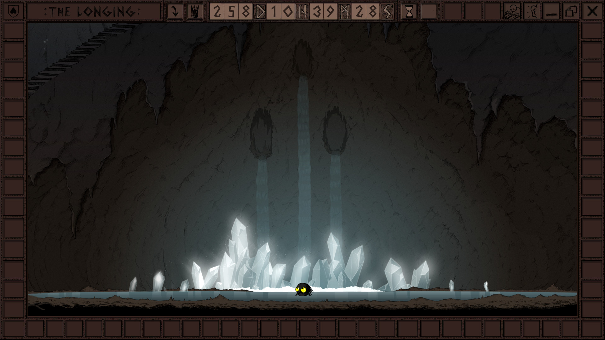

# Descending into Slowness

This journey will span the next 400 days. 400 days of waiting. 400 days of slowly marching towards some end unknown to us.

Forgoing the suspense for some brief moments, the journey we are taking is a virtual one: we will be playing [_The Longing_](https://store.steampowered.com/app/893850/THE_LONGING/).

We are not really sure what to expect, as we have agreed upon some rules going into this experience:

* We will not spoil the game for ourselves
* We will keep a log or journal detailing our days as we play \(it may be first person, third person, or take the shape of random notes as time goes on\)
* We will not read each other's logs until the end, though we may discuss occurrences as they arise

So, what is the big deal with this game? Why are we going about playing it with such ceremony? At the end of the day, because it seems _awesome_. Neither of us have played a game quite like this one. I don't believe a game like this has really existed before: the moment the game starts, a timer that lasts 400 days begins. This timer continues to tick even when the game is closed. After 400 days, the game ends. What we do may have an impact on the ending, but we are not sure.

The Steam page states that you do not need to interact with the game to play it, as the timer will tick regardless and the end **will come**. Knowing us, however, we will resort to exploring our surroundings so that we may eventually piece together the mystery of this game, and of the playable character: the Shade.

Well, that is about all I have to say at this point, as I truly do not know that much more about this game! If I have kept your interest thus far, feel free to tag along in our journeys by following this journal, and/or @abergstromstarks'! 

* My journal: [https://joshuathemiller.gitbook.io/of-considerable-length/](https://joshuathemiller.gitbook.io/of-considerable-length/)
* @abergstromstarks' journal: [https://abergstromstarks.gitbook.io/yearning/](https://abergstromstarks.gitbook.io/yearning/)

