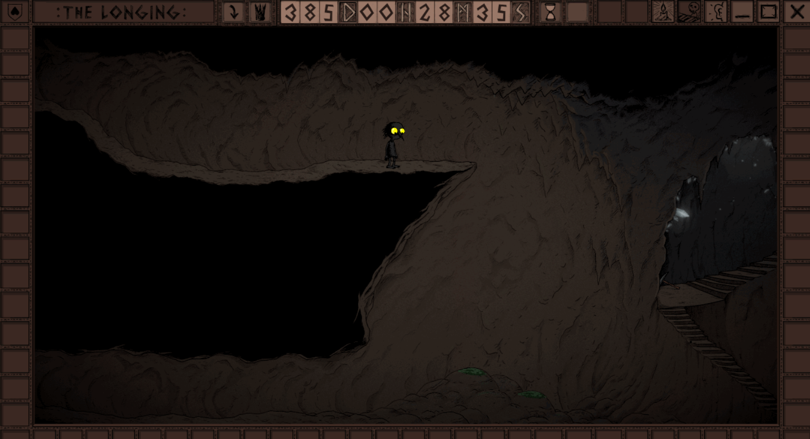
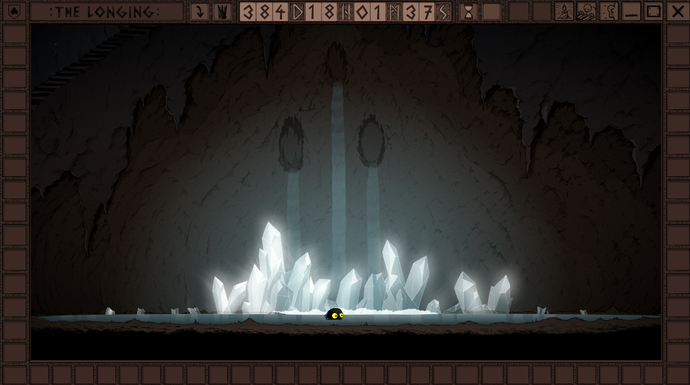

# 387-384 - Picking

I never realized the book _Moby Dick_ could be so enthralling. It seems that I have lost another three days inside of its pages. This will not do, however, especially as I know there are parts of the cave waiting for me, and more coal brothers to collect.

As expected of my first stop, the moss had grown enough on the eastern side of the cave system for me to jump down.

Unfortunately, my moss collecting reflexes activated too quickly, and I picked the moss that had become my soft landing... I had better explore this area thoroughly as I will not be coming back for another two weeks.

Exploration of this new area lead me to two surprising discoveries: a glorious pond, and a mattock! This should allow me to dig out more of my living space; enough, perhaps, for a bed. Before going home, I finished exploring this pond area to the best of my ability, and collected the crystals growing around the pond. While breaking the crystals from the grasp of the earth, I contemplated a dream I had where I had been the King. What an amazing experience that had been.

Finally \(truly\) after triple checking that I had explored the cave pond area thoroughly, I headed home to dig out a space for my bed. It took a bit of time, but it was worth it! Now I just need to find more wood, and collect even more moss.

The breaking of the crystals by the pond seems to have reinvigorated my sense of exploration. I must now check every nook and cranny of this cave system to see what new paths can be formed...

It seems that my mattock is not strong enough to break through granite, and granite is what seems to be behind many paths. My disappointment has grown. I wonder if my cave face friend can help with that.

On a less disappointing note, I have rescued a pink crystal from lonely clutches of the cavern.

